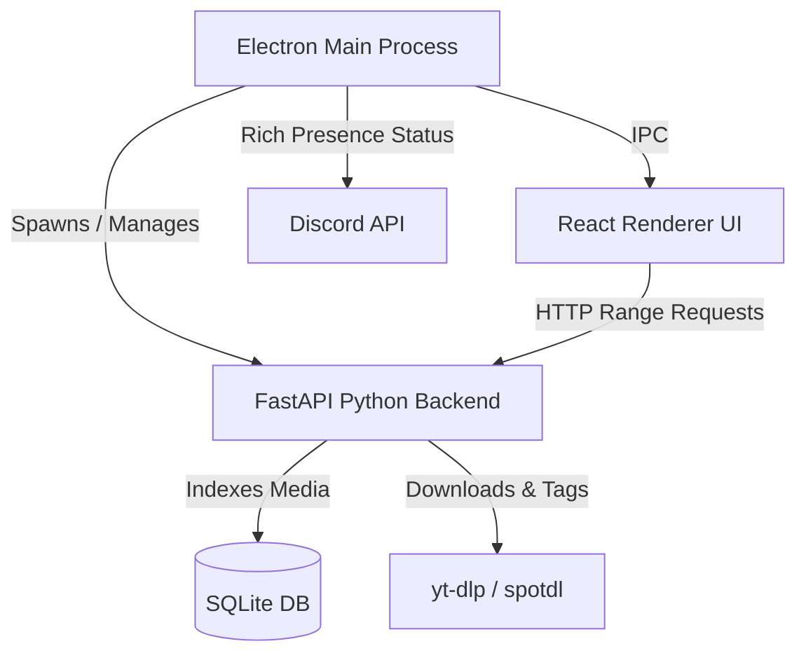

# 🎵 Pocket Music

<p align="center">
  
</p>

<h3 align="center">Pocket Music</h3>

<p align="center">
  <strong>A Pixel-Accurate Spotify-Style Local Music Player & Downloader</strong>
</p>

<p align="center">
  
  
  
  
  
</p>

---

## ✨ Overview

**Pocket Music** is an elegant, pixel-accurate clone of the Spotify desktop client, built specifically for playing and organizing your local audio files. It features an integrated high-performance Python backend that can search, download, and auto-tag tracks from Spotify and YouTube using `yt-dlp` and `spotdl`, complete with high-quality album art and metadata.

No subscriptions, no ads—just your music, locally owned, running in a sleek desktop app wrapper.

---

## 🚀 Key Features

*   🎨 **Pixel-Accurate Spotify UI**: Completely matched interface, including the sidebar, player controls, queuing, search bar, active playlists, and responsive grid layouts.
*   ⚡ **Translucent Vibrancy & Sleek Themes**: macOS vibrancy and Windows custom frame support for a ultra-premium native app feel.
*   📥 **Integrated Smart Downloader**: Input Spotify track/album/playlist URLs or search terms to automatically fetch audio files and convert them to high-bitrate MP3s.
*   🏷️ **Automatic Metadata Tagging**: Fully auto-tags downloaded tracks with correct title, artist, album, track number, lyrics, and embedded high-resolution album cover art.
*   🎮 **Discord Rich Presence (DRPC)**: Automatically displays your current track, artist, album art, and progress directly in Discord with real-time updates.
*   🔍 **Instant Library Scanner**: Automatically parses your music directory, indexing files in a high-speed SQLite database for lightning-fast search and sorting.
*   ⌨️ **Media Key Support & Global Shortcuts**: Full integration with native OS media controls (Play/Pause, Next, Previous).

---

## 🛠️ Architecture

Pocket Music utilizes a hybrid multi-process architecture to combine Electron's native desktop integration with Python's rich media processing ecosystem.



---

## 📦 Tech Stack

*   **Frontend**: React (v18), TypeScript, Tailwind CSS, Lucide React, Zustand (State Management).
*   **Desktop App Layer**: Electron (v31) with Secure IPC, Preload Scripts, and Native Window integration.
*   **Backend Services**: Python 3, FastAPI, Uvicorn, Mutagen (ID3 Metadata tagging), `yt-dlp` (Media downloader).
*   **Database**: SQLite via `better-sqlite3` for local library persistence and ultra-low-latency queries.

---

## ⚙️ Development & Run

### Prerequisites
*   [Node.js](https://nodejs.org/) (v20+)
*   [Python](https://www.python.org/) (v3.11+), with dependencies in `backend/requirements.txt` installed.
*   [FFmpeg](https://ffmpeg.org/) installed and available on your system `PATH` (required for audio conversions).

### Installation

1.  **Clone the repository**:
    ```bash
    git clone https://github.com/satiricalguru/Pocket-Music.git
    cd Pocket-Music
    ```

2.  **Install Node dependencies**:
    ```bash
    npm install
    ```

3.  **Install Python dependencies**:
    ```bash
    pip install -r backend/requirements.txt
    ```

### Running Locally

To launch the application in development mode with hot-reloading for both the Vite frontend and Electron processes:

```bash
npm run dev
```

---

## 🚀 Building & Distribution

Build production installers for your platform using the packaged `electron-builder` configuration:

### macOS (`.dmg`)
```bash
npm run dist:mac
```

### Windows (`.exe` NSIS installer)
```bash
npm run dist:win
```

### All Platforms
```bash
npm run dist:all
```

*Note: Code signing can be skipped locally for development builds by setting the environment variable `CSC_IDENTITY_AUTO_DISCOVERY=false`.*

---

## 📄 License

This project is licensed under the MIT License. See the [LICENSE](LICENSE) file for details.
