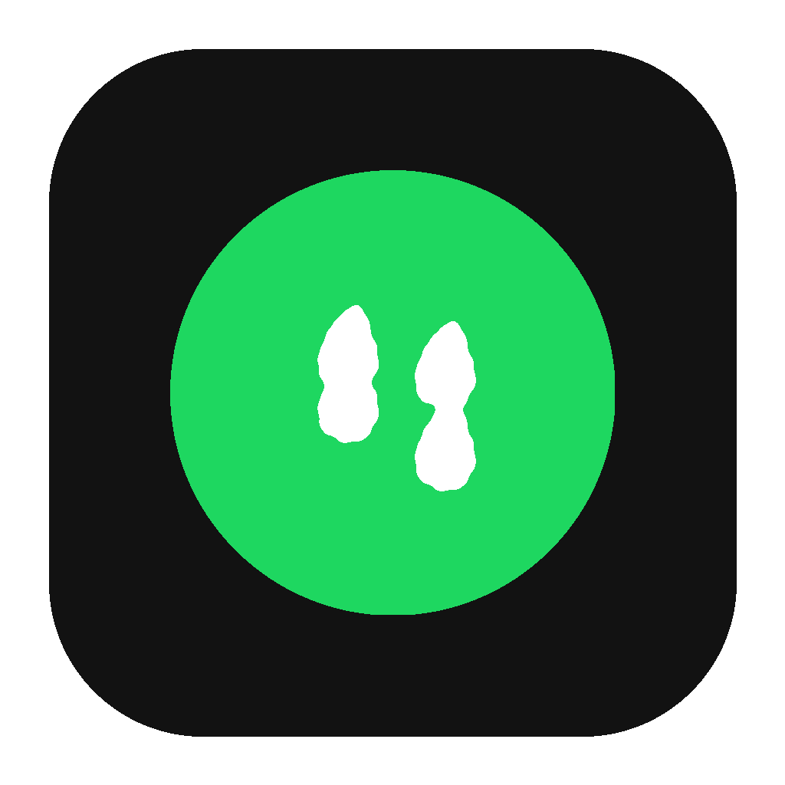
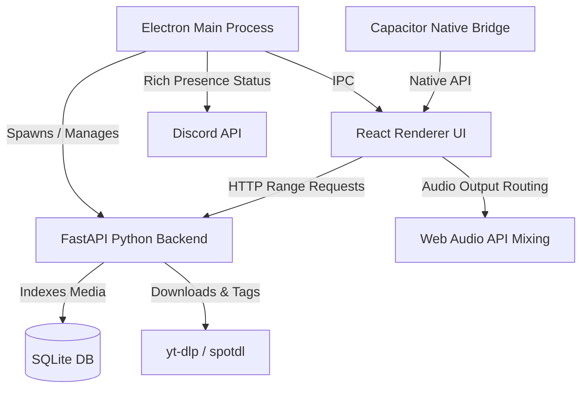

# 🎵 Pocket Music

<p align="center">
  
</p>

<h3 align="center">Pocket Music</h3>

<p align="center">
  <strong>A Pixel-Accurate Spotify-Style Local Music Player, Downloader & Audio Soundboard</strong>
</p>

<p align="center">
  
  
  
  
  
  
</p>

<p align="center">
  <a href="https://github.com/satiricalguru/Pocket-Music/releases/download/v1.0.0/Pocket.Music-1.0.0-arm64.dmg">
    
  </a>
  <a href="https://github.com/satiricalguru/Pocket-Music/releases/download/v1.0.0/Pocket.Music-1.0.0.dmg">
    
  </a>
  <a href="https://github.com/satiricalguru/Pocket-Music/releases/download/v1.0.0/Pocket.Music.Setup.1.0.0.exe">
    
  </a>
  <a href="https://github.com/satiricalguru/Pocket-Music/releases/download/v1.0.0/Pocket.Music.Setup.1.0.0.apk">
    
  </a>
</p>

---

## ✨ Overview

**Pocket Music** is an elegant, pixel-accurate clone of the Spotify client, built for desktop and mobile environments. Organize, play, and search your local audio files. It features an integrated high-performance Python backend (via FastAPI) that downloads and auto-tags tracks from Spotify and YouTube using `yt-dlp` and `spotdl`, complete with high-quality metadata.

With our latest update, Pocket Music is now **fully mobile-responsive** with Capacitor Android integration, and features a **Web Audio Soundboard** for live mic and music mixing.

No subscriptions, no ads—just your music, locally owned and beautifully displayed.

---

## 📥 Downloads

If you just want to run the application without building it from source, you can download the latest pre-compiled packages directly for your platform:

| Platform | Architecture | Installer / Package Link |
| :--- | :--- | :--- |
| 🍎 **macOS** | Apple Silicon (M1/M2/M3/M4) | [Download `.dmg` (ARM64)](https://github.com/satiricalguru/Pocket-Music/releases/download/v1.0.0/Pocket.Music-1.0.0-arm64.dmg) |
| 🍎 **macOS** | Intel Processor | [Download `.dmg` (x64)](https://github.com/satiricalguru/Pocket-Music/releases/download/v1.0.0/Pocket.Music-1.0.0.dmg) |
| 🔷 **Windows** | Windows 10 / 11 (64-bit) | [Download Setup `.exe`](https://github.com/satiricalguru/Pocket-Music/releases/download/v1.0.0/Pocket.Music.Setup.1.0.0.exe) |
| 🤖 **Android** | Android Phone / Tablet | [Download `.apk` (Capacitor)](https://github.com/satiricalguru/Pocket-Music/releases/download/v1.0.0/Pocket.Music.Setup.1.0.0.apk) |

*You can also view all releases, changelogs, and older builds on the [GitHub Releases Page](https://github.com/satiricalguru/Pocket-Music/releases).*

---

## 🚀 Key Features

*   🎨 **Pixel-Accurate Spotify UI**: Completely matched interface, including the sidebar, player controls, queuing, search bar, active playlists, and responsive grid layouts.
*   📱 **Cross-Platform Mobile Integration**: Fully responsive Spotify-like mobile client powered by **Capacitor**, featuring a dedicated bottom navigation bar, touch-friendly context menus, and a premium "Now Playing" full-screen mobile panel.
*   🎛️ **Audio Soundboard Panel**: Built-in soundboard with mic + music real-time Web Audio mixing, volume control, and custom hardware output device routing.
*   ⚡ **Translucent Vibrancy & Sleek Themes**: macOS vibrancy and Windows custom frame support for an ultra-premium native desktop app feel.
*   📥 **Integrated Smart Downloader**: Input Spotify track/album/playlist URLs or search terms to automatically fetch audio files and convert them to high-bitrate MP3s.
*   🏷️ **Automatic Metadata Tagging**: Fully auto-tags downloaded tracks with correct title, artist, album, track number, lyrics, and embedded high-resolution album cover art.
*   🎮 **Discord Rich Presence (DRPC)**: Automatically displays your current track, artist, album art, and progress directly in Discord with real-time updates (Desktop only).
*   🔍 **Instant Library Scanner**: Automatically parses your music directory, indexing files in a high-speed SQLite database for lightning-fast search and sorting.
*   ⌨️ **Media Key Support & Global Shortcuts**: Full integration with native OS media controls (Play/Pause, Next, Previous).

---

## 🛠️ Architecture

Pocket Music utilizes a hybrid multi-process architecture to combine Electron's native desktop features and Capacitor's mobile runtime with Python's rich media processing ecosystem.



---

## 📦 Tech Stack

*   **Frontend**: React (v18), TypeScript, Tailwind CSS, Lucide React, Zustand (State Management).
*   **Desktop Layer**: Electron (v31) with Secure IPC, Preload Scripts, and Native Window integration.
*   **Mobile Layer**: Capacitor (v8) with a native Android project wrapper.
*   **Backend Services**: Python 3, FastAPI, Uvicorn, Mutagen (ID3 Metadata tagging), `yt-dlp` (Media downloader).
*   **Database**: SQLite via `better-sqlite3` for local library persistence and ultra-low-latency queries.

---

## ⚙️ Development & Run

### Prerequisites
*   [Node.js](https://nodejs.org/) (v22+)
*   [Python](https://www.python.org/) (v3.11+), with dependencies in `backend/requirements.txt` installed.
*   [FFmpeg](https://ffmpeg.org/) installed and available on your system `PATH` (required for audio conversions).
*   *For Android development*: [Android Studio](https://developer.android.com/studio) and JDK 21.

### Installation

1.  **Clone the repository**:
    ```bash
    git clone https://github.com/satiricalguru/Pocket-Music.git
    cd Pocket-Music
    ```

2.  **Install Node dependencies**:
    ```bash
    npm install
    ```

3.  **Install Python dependencies**:
    ```bash
    pip install -r backend/requirements.txt
    ```

### Running Locally

#### Desktop (Electron)
To launch the application in development mode with hot-reloading for both the Vite frontend and Electron processes:
```bash
npm run dev
```

#### Mobile (Android Emulator / Device)
To compile the web assets, sync them with the Capacitor project, and run the Android app:
```bash
# Build the React application
npm run build

# Sync assets and dependencies to the Android project
npx cap sync

# Open the project in Android Studio (or run directly from CLI)
npx cap open android
```

---

## 🚀 Building & Distribution

Build production installers or APK packages for your platform:

### macOS (`.dmg`)
```bash
npm run dist:mac
```

### Windows (`.exe` NSIS installer)
```bash
npm run dist:win
```

### Android APK (`.apk` debug / release)
You can build the APK directly through Android Studio or run the command line gradle wrapper:
```bash
cd android && ./gradlew assembleDebug
```
*Note: A GitHub Actions workflow (`android.yml`) is configured to automatically build and release the Android APK on every push to the `main` branch.*

---

## 📄 License

This project is licensed under the MIT License. See the [LICENSE](LICENSE) file for details.
